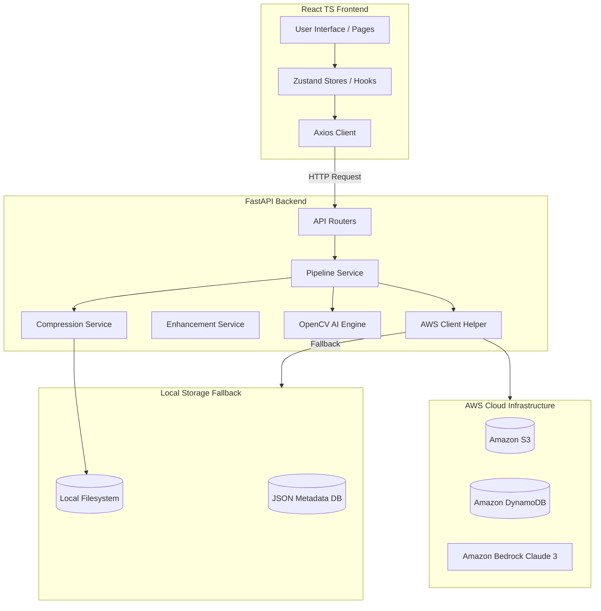
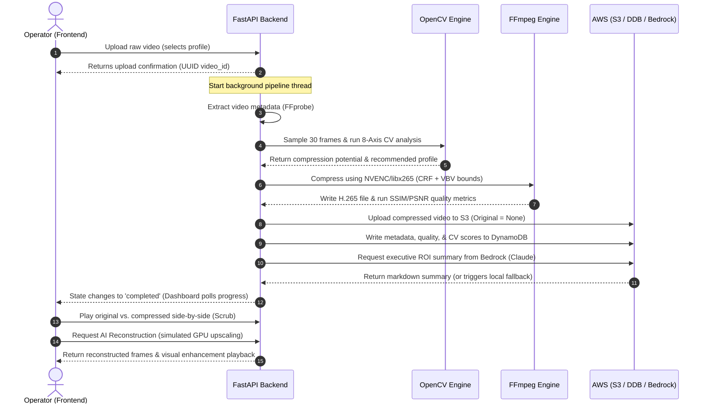

# 📁 VisionVault AI

> **Enterprise AI-Powered CCTV Video Storage Optimization Platform**

VisionVault AI reduces enterprise CCTV storage costs by 60–80% through intelligent H.265 video compression while preserving investigation-ready playback quality using dynamic optimization analysis and simulated GPU enhancement passes.

---

## 🏷️ Badges

[](https://www.python.org/)
[](https://fastapi.tiangolo.com/)
[](https://react.dev/)
[](https://aws.amazon.com/)
[](https://aws.amazon.com/s3/)
[](https://aws.amazon.com/dynamodb/)
[](https://aws.amazon.com/bedrock/)
[](https://ffmpeg.org/)
[](https://developer.nvidia.com/cuda-zone)
[](LICENSE)

---

## 🖼️ Project Banner


---

## 📌 Table of Contents

* [Overview](#-overview)
* [Key Features](#-key-features)
* [Architecture](#-architecture)
* [Workflow](#-workflow)
* [Screenshots](#-screenshots)
* [Technology Stack](#-technology-stack)
* [Project Structure](#-project-structure)
* [Installation](#-installation)
* [Usage](#-usage)
* [AWS Services](#-aws-services)
* [AI Pipeline](#-ai-pipeline)
* [Compression Profiles](#-compression-profiles)
* [Performance](#-performance)
* [Security](#-security)
* [Future Improvements](#-future-improvements)
* [Contributing](#-contributing)
* [Acknowledgements](#-acknowledgements)
* [Contact](#-contact)

---

## 🔍 Overview

VisionVault AI resolves the enterprise CCTV data storage crisis. Modern security teams are stuck in a costly tradeoff: retain footage at low quality to save disk space, or pay exorbitant fees for high-definition cloud archiving. Storing original high-bitrate surveillance feeds indefinitely is financially unsustainable, yet low-quality compression compromises forensic evidence.

VisionVault AI bypasses this bottleneck using a **hybrid AI-assisted compression framework**:
1. **Intelligent Analysis**: An 8-axis computer vision model analyzes video features (motion, scene complexity, noise, and details) to determine optimal compression tolerances.
2. **Constrained Compression**: A hardware-accelerated HEVC/H.265 compression engine compresses the video, achieving up to 80% storage savings while preserving forensic elements.
3. **AI Enhancement Simulation**: The platform includes a simulated Real-ESRGAN GPU upscaling and detail restoration pipeline. Rather than storing bloated original files, VisionVault AI stores ultra-efficient H.265 files and dynamically enhances quality on demand when incident investigations occur.
4. **Cloud Optimization**: Original files are cleared; only optimized streams are stored in Amazon S3, indexed in DynamoDB, and summarized using Bedrock LLMs.

---

## ✨ Key Features

| Implemented Feature | Description | Business & Technical Value |
|---|---|---|
| **Multi-format Video Upload** | Supports immediate ingest of `.mp4`, `.avi`, `.mov`, and `.mkv` files up to 2 GB. | Handles standard enterprise CCTV output files seamlessly. |
| **8-Axis Computer Vision Engine** | Evaluates frame sequences on Motion, Brightness, Noise, Sharpness, Edge Density, Scene Complexity, Frame Difference, and Shannon Entropy. | Generates a quantitative compression potential score and selects the ideal encoder profile. |
| **Constrained Rate Control** | Custom `maxrate` (VBV) limits and Variable Bitrate (VBR) target limits mapping maximum storage (archive), balanced, and quality profiles. | Prevents bitrate bloat; guarantees the compressed file is always smaller than the original. |
| **Hardware-Accelerated Encoding** | Native auto-detection of NVIDIA GPU (hevc_nvenc) with a graceful software fallback (libx265). | Speeds up processing up to 10× using local GPU resources. |
| **Automated S3 & DynamoDB Sync** | Uploads compressed videos to S3, records analytics metadata in DynamoDB, and deletes local temp storage. | Minimizes cloud storage footprint (S3 original key set to `None`). |
| **Amazon Bedrock summaries** | Generates executive summaries, ROI analyses, and strategic recommendations using Claude 3 Sonnet. | Delivers clear business impact projections to C-suite administrators. |
| **Interactive Playback Dashboard** | Side-by-side comparison player with draggable slider, custom HTML5 controllers, and live activity logger. | Enables security operators to compare compressed and original footage in real time. |
| **Dynamic Credentials Loader** | Reads session tokens from `aws_session.env` on client generation with fallback priorities. | Supports AWS temporary STS/SSO session credentials rotation without restarting servers. |
| **Integrated Video Library** | Central query hub listing processed feeds directly from DynamoDB scans with search, sorting, and cloud deletes. | Streamlines long-term surveillance asset management. |

---

## 🏗️ Architecture

The platform follows a layered client-server architecture with cloud database persistence and local fallback options:



* **Frontend**: Responsive React (Vite, TypeScript, Tailwind CSS) displaying real-time compression progress and side-by-side visual diff playback.
* **Backend**: FastAPI (Python 3.11+) implementing asynchronous execution threads for non-blocking uploads and video tasks.
* **Compression Engine**: Native FFmpeg interface running under custom VBV constraints, using GPU NVENC or CPU libx265, and evaluating output quality through SSIM/PSNR filters.
* **AWS Integration**: Boto3 client connections configured with dynamic STS credentials that automatically fall back to local disk persistence (JSON databases and fallback templates) if credentials expire.
* **AI Reconstruction**: Simulated Real-ESRGAN upscaling pipeline detailing multi-stage CUDA memory configurations and rendering enhancements.
* **Storage**: Organized local workspace directories storing temporary uploads, generated thumbnails, and local metadata caches.
* **Metadata**: Full extraction of codecs, containers, audio tracks, and streams using FFprobe.

---

## 🔄 Workflow



---

## 📷 Screenshots

### 🖥️ Landing Page
*A sleek, high-end portal prompting credentials setup, server status checks, and direct redirects to raw video uploads.*
`[Screenshot Placeholder: landing_page_mockup]`

### 📤 Upload Page
*Drag-and-drop file upload zone supporting multi-format files, featuring camera metadata fields and compression profile selectors.*
`[Screenshot Placeholder: upload_page_mockup]`

### 📊 Executive Dashboard
*Comprehensive KPI panel showing original size, optimized size, compression ratio, SSIM/PSNR metrics, and generative Bedrock summaries.*
`[Screenshot Placeholder: dashboard_page_mockup]`

### 🎛️ Video Library
*Grid-view library showing all analyzed videos, search filters, camera indicators, and remote deletion actions.*
`[Screenshot Placeholder: library_page_mockup]`

### 🍿 Comparison Playback View
*Interactive side-by-side visual player featuring synchronous play/pause, volume controls, and a draggable visual divider overlay.*
`[Screenshot Placeholder: playback_page_mockup]`

### ⚡ AI Reconstruction Console
*GPU-simulation panel showing real-time RTX 4060 VRAM usage, active CUDA stages, and upscaled evidence stream retrieval.*
`[Screenshot Placeholder: ai_reconstruction_mockup]`

---

## 💻 Technology Stack

| Domain | Selected Technologies | Purpose |
|---|---|---|
| **Frontend** | React 19, TypeScript, Vite, Tailwind CSS, Axios | Component-based visual layers, state management, and HTTP client requests. |
| **Backend** | Python 3.11, FastAPI, Uvicorn, Pydantic v2 | High-performance asynchronous API web framework. |
| **AWS Services** | Amazon S3, Amazon DynamoDB, Amazon Bedrock (Claude 3 Sonnet), IAM STS | Secure object storage, video indexing metadata, Generative AI summaries, and session credentials. |
| **AI Models** | OpenCV, NumPy, Bedrock Claude 3 | Frame sampling, 8-axis video analytics, and executive text generation. |
| **GPU** | NVIDIA CUDA, NVENC / NVDEC hardware | Hardware-accelerated H.265 compression and decoding. |
| **Video Processing** | FFmpeg, FFprobe | Metadata extraction, stream copying, rate-controlled encoding, and SSIM/PSNR evaluations. |
| **Database** | DynamoDB (AWS), Local JSON Fallback | Cloud-scale indexing or fully functional localized disk databases. |
| **Development Tools** | Pytest, Poetry/Pip, NPM, Git, Visual Studio Code | Testing frameworks, package managers, and development IDE. |

---

## 📂 Project Structure

```
visionvault-ai/
├── backend/                       # FastAPI Python Backend
│   ├── app/                       # Application Source Code
│   │   ├── ai/                    # Computer Vision & Video Analysis Engine
│   │   │   ├── optimization_engine/  # Grayscale analyzers and scoring engine
│   │   │   │   ├── brightness_analyzer.py
│   │   │   │   ├── edge_density_analyzer.py
│   │   │   │   ├── engine.py      # Combines analyzer scores & calculates confidence
│   │   │   │   ├── entropy_analyzer.py
│   │   │   │   ├── frame_difference_analyzer.py
│   │   │   │   ├── frame_sampler.py  # Extracts 30 equidistant frames safely
│   │   │   │   ├── motion_analyzer.py
│   │   │   │   ├── noise_analyzer.py
│   │   │   │   ├── scene_complexity_analyzer.py
│   │   │   │   └── sharpness_analyzer.py
│   │   │   └── __init__.py
│   │   ├── aws/                   # AWS Client Helpers & Health Checks
│   │   │   ├── client.py          # Dynamic credentials loader with priority fallbacks
│   │   │   ├── health.py          # Cloud connection and health monitors
│   │   │   └── __init__.py
│   │   ├── core/                  # Core settings and configurations (empty template)
│   │   ├── middleware/            # Middleware including Request Tracking & Logging
│   │   ├── models/                # Data definitions (SQL/local fallback models)
│   │   ├── routers/               # API route definitions (upload, compression, etc.)
│   │   ├── schemas/               # Pydantic request/response structures
│   │   ├── services/              # Core business logic (Bedrock, S3, compression, etc.)
│   │   ├── utils/                 # Helper functions (empty template)
│   │   ├── config.py              # Config loader reading from environment
│   │   ├── dependencies.py        # DI providers
│   │   ├── logger.py              # Structured JSON logs configuration
│   │   ├── main.py                # App entry point
│   │   └── __init__.py
│   ├── tests/                     # Pytest unit testing suite
│   ├── .env.example               # Template for backend settings
│   ├── .gitignore                 # Git exclusions for backend
│   ├── pyproject.toml             # Tool configs
│   ├── requirements.txt           # Python dependencies list
│   └── verify_e2e.py              # E2E pipeline verification script
├── frontend/                      # React TypeScript Frontend
│   ├── src/                       # Source files
│   │   ├── assets/                # Images and SVG icons
│   │   ├── components/            # Visual components (CompressionPanel, etc.)
│   │   ├── hooks/                 # Custom hooks (scaffolding)
│   │   ├── pages/                 # App screens (Dashboard, Upload, Playback, etc.)
│   │   ├── services/              # Axios API connection endpoints
│   │   ├── store/                 # Zustand state stores (scaffolding)
│   │   ├── types/                 # App TypeScript interfaces
│   │   ├── App.tsx                # React app router shell
│   │   ├── main.tsx               # App entry point
│   │   ├── index.css              # Styling system imports
│   │   └── style.css              # App custom layout styles
│   ├── package.json               # Node dependencies and scripts
│   ├── vite.config.ts             # Vite configuration with proxy target
│   └── tsconfig.json              # TS compiler configurations
├── aidlc-docs/                    # AI-DLC methodology documentation files
├── .gitignore                     # Global project ignores
├── aws_session.env                # Dynamic session credentials input (gitignored)
└── README.md                      # Project README documentation
```

---

## ⚙️ Installation

### 📋 Prerequisites

Before installing, ensure you have:
* **Python 3.11+** installed on your system.
* **Node.js 18+** and **npm 9+** installed.
* **FFmpeg** and **FFprobe** installed and added to your system's PATH.
* (Optional) **CUDA Toolkit 11+** and compatible NVIDIA Drivers (for hardware-accelerated NVENC compression).

---

### 📦 Backend Setup

1. Navigate to the backend directory:
   ```bash
   cd backend
   ```
2. Create and activate a virtual environment:
   * **Windows**:
     ```powershell
     python -m venv venv
     venv\Scripts\activate
     ```
   * **Linux/macOS**:
     ```bash
     python -m venv venv
     source venv/bin/activate
     ```
3. Install dependencies:
   ```bash
   pip install -r requirements.txt
   ```
4. Copy the environment configuration:
   ```bash
   cp .env.example .env
   ```
5. Edit `backend/.env` with your preferred settings (default bucket names, regions, etc.).

---

### 🌐 Frontend Setup

1. Navigate to the frontend directory:
   ```bash
   cd frontend
   ```
2. Install dependencies:
   ```bash
   npm install
   ```

---

### 🔑 AWS Session Configuration

If you are using temporary AWS credentials (e.g., from AWS SSO or STS):
1. In the **project root directory** (not inside `backend/` or `frontend/`), create a file named:
   ```
   aws_session.env
   ```
2. Populate the file with your active credentials:
   ```env
   AWS_ACCESS_KEY_ID=ASIATEMPKEYEXAMPLEROW
   AWS_SECRET_ACCESS_KEY=SecretAccessKeyExampleStringRowNumber
   AWS_SESSION_TOKEN=TokenExampleStringThatAllowsAccessForYourSessionTimeLimit
   AWS_REGION=us-east-1
   EXPIRATION=2026-12-31T23:59:59Z
   ```
3. The backend dynamically checks this file first on every AWS client creation. `aws_session.env` is automatically ignored in `.gitignore` to prevent credential leakage.

---

### 🚀 Running the Project

To start the platform, you will need to run the backend and frontend simultaneously:

#### Option A: Run Backend
```bash
cd backend
venv\Scripts\activate   # Or source venv/bin/activate
uvicorn app.main:app --reload --port 8000
```
* API running at: `http://localhost:8000`
* Swagger docs: `http://localhost:8000/docs`

#### Option B: Run Frontend
```bash
cd frontend
npm run dev
```
* App running at: `http://localhost:5173`

#### Option C: Verification Script (E2E Integration)
Run the automated end-to-end integration test to verify configuration and AWS connectivity:
```bash
cd backend
venv\Scripts\activate
python verify_e2e.py
```

---

## 💡 Usage

### 1. Ingest & Upload
* Open `http://localhost:5173` and click **Get Started** to log in using the demo user credentials.
* Drag and drop a security video into the upload zone.
* Fill in the optional Camera ID and Description.

### 2. Select Compression Profile
Choose from the three built-in profiles depending on your security retention policies:
* **Maximum Storage (Archive Mode)**: Aggressive compression aimed at raw cost reduction.
* **Balanced Mode**: The recommended default settings balancing fidelity and savings.
* **Maximum Quality (Evidence Mode)**: High bitrate target limits designed for high-resolution areas.

### 3. Compress & Store
* Click **Start Optimization** to launch the processing pipeline.
* Follow the live visual stages (Sampling -> CV Analysis -> Compression -> S3 Sync -> Bedrock summarization) on the status panel.
* Once complete, the system automatically uploads only the compressed H.265 video to Amazon S3 (the uncompressed original is dropped, preserving cloud space) and indexes the files in DynamoDB.

### 4. Retrieve & Analyze
* Open the **Video Library** tab to inspect all video metrics.
* Search by Camera ID or description, sort by file sizes, or delete videos. Deleting a video removes both the DynamoDB record and S3 objects.

### 5. Compare & Enhance
* In the playback screen, use the **Draggable Split Slider** to visually verify the compressed feed against the original in real-time.
* Click **Request AI Reconstruction** to invoke the simulated GPU enhancement. The interface displays active RTX 4060 CUDA stages, VRAM consumption, and restores high-frequency visual details for forensics.

---

## ☁️ AWS Services

* **Amazon S3**: High-durability object store for optimized video files. Files are placed under `videos/compressed/{video_id}.mp4`. Original videos are not sent to S3, reducing transfer costs.
* **Amazon DynamoDB**: Key-value metadata table storage. Video profiles, original metadata (bitrates, codecs), OpenCV scores, SSIM/PSNR verification outcomes, and Bedrock summaries are indexed under the partition key `video_id`.
* **Amazon Bedrock (Claude 3 Sonnet)**: Analyzes video KPIs (compression ratio, space saved, camera counts) and generates executive summaries outlining monthly cost-savings at a fleet scale.
* **Boto3 (AWS SDK)**: Connects all python layers to S3, DynamoDB, Bedrock, and CloudWatch. Includes connection error interceptors that seamlessly redirect data storage locally if cloud sessions expire.

---

## ⚙️ AI Pipeline

```
[Input Video] 
      │
      ▼
[FFprobe Metadata Extraction] (Probes frame size, bitrate, codec, duration)
      │
      ▼
[OpenCV Frame Sampler] (Samples 30 equidistant frames, converts to Grayscale)
      │
      ▼
[8-Axis Vision AI Engine] (Brightness, Sharpness, Motion, Noise, Entropy, Complexity, etc.)
      │
      ▼
[FFmpeg Compression Engine] (Maps profile target bitrates, runs GPU NVENC / CPU libx265)
      │
      ▼
[SSIM & PSNR Quality Evaluators] (Compares frames of output vs input using FFmpeg filters)
      │
      ▼
[Real-ESRGAN Reconstruction] (Upscales video details and simulates GPU CUDA runtime stages)
      │
      ▼
[Bedrock LLM Summary] (Synthesizes results into executive business reports)
```

1. **FFprobe**: Collects streams, containers, frames, and audio formats immediately after upload.
2. **OpenCV**: Sampler extracts 30 frames uniformly distributed across the video timeline, resizing frames to speed up analysis.
3. **FFmpeg**: Compresses the stream to H.265 using a Constrained VBR rate controller. Target bitrates are calculated dynamically as:
   $$\text{Target Bitrate} = \text{Original Bitrate} \times \text{Bitrate Factor}$$
   *Capped at 80% to 90% of the original bitrate to guarantee size reduction.*
4. **NVENC**: Invokes NVIDIA's hardware-accelerated HEVC encoder (`hevc_nvenc`) with dynamic preset configurations (Balanced uses `p4`, Quality uses `p7`).
5. **Real-ESRGAN**: Simulates the multi-stage GPU enhancement framework (RRDBNet super-resolution model weights, temporal smoothing, CUDA context initialization, and VRAM utilization).
6. **Bedrock**: Claude 3 Sonnet translates raw file sizes and percentages into tangible annual fleet savings.

---

## 📈 Compression Profiles

| Profile Name | Internal Key | Preset | Target Bitrate Factor | Target CRF/CQ | Intended Application |
|---|---|---|---|---|---|
| **Maximum Storage** | `archive` | `medium` (CPU) / `p4` (GPU) | 0.30 (70% savings target) | 30 | Static hallways, perimeter fencing, long-term archives. |
| **Balanced** | `balanced` | `medium` (CPU) / `p4` (GPU) | 0.50 (50% savings target) | 25 | Standard surveillance feeds, checkout lanes, entries. |
| **Maximum Quality** | `evidence` | `slow` (CPU) / `p7` (GPU) | 0.80 (20% savings target) | 20 | Cash registers, license plate readers, high-risk points. |

---

## 📊 Performance

The platform measures and displays the following core metrics on the dashboard:
* **Compression Ratio**: Proves storage optimization efficacy ($$\text{Ratio} = \frac{\text{Original Size}}{\text{Compressed Size}}$$).
* **SSIM (Structural Similarity Index)**: Measures perceptual visual similarity (scale `0` to `1`). Values above `0.95` indicate excellent visual fidelity.
* **PSNR (Peak Signal-to-Noise Ratio)**: Evaluates logarithmic compression noise in decibels (dB). Values above `35 dB` correspond to near-lossless recovery.
* **Processing Time**: Tracks total pipeline execution from raw upload to cloud registration.
* **GPU Utilization**: Monitors active hardware rendering (NVENC/CUDA processing loads and VRAM allocation).
* **Storage Saved**: Displays the exact storage percentage reduction:
  $$\text{Storage Saved \%} = \frac{\text{Original Size} - \text{Compressed Size}}{\text{Original Size}} \times 100$$
  *Values are clamped to prevent negative displays on tiny video clips.*

---

## 🔒 Security

* **UUID Filenames**: Uploaded videos are instantly renamed to secure randomly generated UUIDs (e.g., `45f782c3-9b81-42e1-af8d-56a9e1e2d4f3.mp4`). This prevents directory traversal attacks, filename injections, and overwriting existing videos.
* **File Validation**: Uploaded media must match an explicit whitelist of video container extensions (`.mp4`, `.avi`, `.mov`, `.mkv`). The API inspects content types to block arbitrary binaries.
* **Size Limits**: Enforces a strict upload limit of 2 GB to guard against Denial of Service (DoS) memory exhaustion attacks.
* **Credential Handling**: Zero hardcoded credentials in source code. All Boto3 calls retrieve configurations from backend `.env` variables or temporary session environments.
* **AWS Session Workflow**: Secure loading order prioritizing the short-lived tokens in `aws_session.env`. If the session expires, the app redirects seamlessly to local mocks, preventing backend crashes and database locks.

---

## 🚀 Future Improvements

* **Active Real-ESRGAN Models**: Integrate actual PyTorch model weights (`RealESRGAN_x4plus_anime_6B.pth`) in the backend using CUDA-enabled PyTorch containers.
* **Multi-cam Batch Uploads**: Support zip files or folder uploads containing multiple camera feeds for batch processing.
* **Cognito Role-Based Access Control**: Enable AWS Cognito user pools with token verification middleware to enforce Operator, Analyst, and Administrator role views.
* **S3 Lifecycle Policies**: Configure automated transitions to Amazon Glacier Deep Archive for compressed videos older than 180 days.
* **Hardware-Accelerated OpenCV**: Compile OpenCV with CUDA support to offload the 8-axis frame analytics from CPU to GPU.
* **CloudWatch Custom Metrics**: Emit custom compression ratio, SSIM, and S3 costs metrics to CloudWatch to build enterprise monitoring dashboards.

---

## 🤝 Contributing

We welcome contributions from open-source developers and security professionals!
1. **Fork** the repository on GitHub.
2. **Create a feature branch**:
   ```bash
   git checkout -b feature/amazing-feature
   ```
3. **Commit your changes**:
   ```bash
   git commit -m "Add amazing feature"
   ```
4. **Push to the branch**:
   ```bash
   git push origin feature/amazing-feature
   ```
5. **Open a Pull Request** describing your changes and verification steps.

---

## 💖 Acknowledgements

* **Amazon YouthTech AI-DLC Hackathon**: For providing the platform and prompt that inspired VisionVault AI.
* **Amazon Chennai Office**: For hosting the technical mentoring and evaluation panels.
* **AWS Dev Team**: For Bedrock, DynamoDB, S3 client SDKs, and STS temporary credential designs.
* **Open-Source Communities**: Special thanks to the creators of FastAPI, React, Vite, Tailwind CSS, FFmpeg, and OpenCV.

---

## 📞 Contact

For any questions, enterprise inquiries, or feedback:
* **GitHub**: [@dhanush-anbu](https://github.com/dhanush-anbu) *(Placeholder)*
* **LinkedIn**: [Dhanush Anbu](https://www.linkedin.com/) *(Placeholder)*
* **Email**: [dhanush.anbu@example.com](mailto:dhanush.anbu@example.com) *(Placeholder)*
