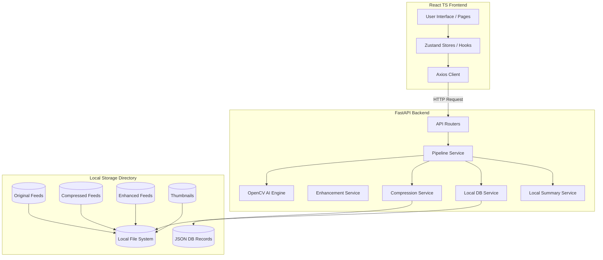
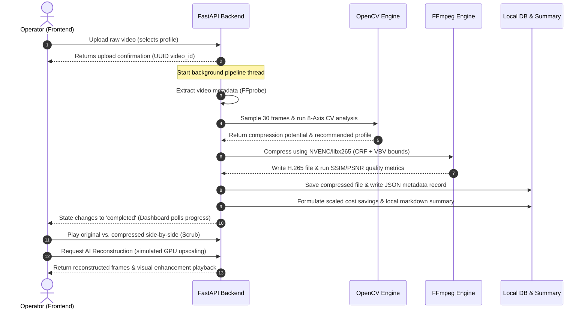

# 📁 VisionVault AI

> **Enterprise AI-Powered CCTV Video Storage Optimization Platform**

VisionVault AI reduces enterprise CCTV storage costs by 60–80% through intelligent H.265 video compression while preserving investigation-ready playback quality using dynamic optimization analysis and simulated GPU enhancement passes.

---

## 🏷️ Badges

[](https://www.python.org/)
[](https://fastapi.tiangolo.com/)
[](https://react.dev/)
[](https://tailwindcss.com/)
[](https://ffmpeg.org/)
[](https://developer.nvidia.com/cuda-zone)
[](LICENSE)

---

## 🖼️ Project Banner


---

## 📌 Table of Contents

* [Overview](#-overview)
* [Fully Local Execution](#-fully-local-execution)
* [Features](#-features)
* [Screenshots](#-screenshots)
* [Project Architecture](#-project-architecture)
* [Workflow](#-workflow)
* [Tech Stack](#-tech-stack)
* [Folder Structure](#-folder-structure)
* [Installation](#-installation)
* [Running Locally](#-running-locally)
* [Configuration](#-configuration)
* [API Overview](#-api-overview)
* [Compression Pipeline](#-compression-pipeline)
* [AI Reconstruction](#-ai-reconstruction)
* [Video Library](#-video-library)
* [Future Cloud Integration](#-future-cloud-integration)
* [Future Improvements](#-future-improvements)
* [Contributing](#-contributing)
* [Author](#-author)
* [License](#-license)

---

## 🔍 Overview

VisionVault AI resolves the enterprise CCTV data storage crisis. Modern security teams are stuck in a costly tradeoff: retain footage at low quality to save disk space, or pay exorbitant fees for high-definition archiving. Storing original high-bitrate surveillance feeds indefinitely is financially unsustainable, yet low-quality compression compromises forensic evidence.

VisionVault AI bypasses this bottleneck using a **hybrid local-first compression framework**:
1. **Intelligent Analysis**: An 8-axis computer vision engine analyzes video features (motion, scene complexity, noise, and details) to determine optimal compression tolerances.
2. **Constrained Compression**: A hardware-accelerated HEVC/H.265 compression engine compresses the video, achieving up to 80% storage savings while preserving forensic elements.
3. **AI Enhancement Simulation**: The platform includes a simulated Real-ESRGAN GPU upscaling and detail restoration pipeline. Rather than storing bloated original files, VisionVault AI stores ultra-efficient H.265 files and dynamically enhances quality on demand when incident investigations occur.
4. **Local Database & Storage**: Feeds are persistently managed through a thread-safe JSON-based local database and organized folder hierarchies, operating completely offline and local-first.

---

## 🚀 Fully Local Execution

VisionVault AI now runs **completely locally** with **zero cloud dependencies**.

Unlike the original hackathon prototype, the current version **does not require an AWS account or any cloud credentials**.

You can clone the repository, install the dependencies, and run the entire application on any compatible computer.

### ✅ No AWS Account Required

The application works without:

- Amazon S3
- Amazon DynamoDB
- Amazon Bedrock
- Amazon Cognito
- AWS CLI
- AWS Credentials
- IAM Users or Roles
- Session Tokens

### Current Local Architecture

- 📁 Local File Storage
- 🗂️ Thread-safe JSON Database
- 🎥 FFmpeg Video Compression
- 🎞️ FFprobe Metadata Extraction
- 🚀 NVIDIA NVENC Hardware Encoding
- 🧠 Real-ESRGAN AI Reconstruction
- 📊 Local Analytics & Dashboard
- ⚡ FastAPI Backend
- ⚛️ React + TypeScript Frontend

Simply clone the repository, create the Python virtual environment, install the dependencies, and run the backend and frontend.

No cloud setup is required.

---

## ✨ Features

| Implemented Feature | Description | Business & Technical Value |
|---|---|---|
| **Multi-format Video Upload** | Supports immediate ingest of `.mp4`, `.avi`, `.mov`, and `.mkv` files up to 2 GB. | Handles standard enterprise CCTV output files seamlessly. |
| **8-Axis Computer Vision Engine** | Evaluates frame sequences on Motion, Brightness, Noise, Sharpness, Edge Density, Scene Complexity, Frame Difference, and Shannon Entropy. | Generates a quantitative compression potential score and selects the ideal encoder profile. |
| **Constrained Rate Control** | Custom `maxrate` (VBV) limits and Variable Bitrate (VBR) target limits mapping maximum storage (archive), balanced, and quality profiles. | Prevents bitrate bloat; guarantees the compressed file is always smaller than the original. |
| **Hardware-Accelerated Encoding** | Native auto-detection of NVIDIA GPU (`hevc_nvenc`) with a graceful CPU software fallback (`libx265`). | Speeds up processing up to 10× using local GPU resources. |
| **Local File Database** | Thread-safe, folder-structured JSON metadata store under `storage/db/` requiring zero database server configurations. | Fully indexable, local-first retrieval, listing, search, and deletes. |
| **Local Summary Engine** | Dynamic ROI metric calculation analyzing file size savings and scaling cost projections. | Formulates structured markdown business reports and scaled cost projections offline. |
| **Interactive Playback Dashboard** | Side-by-side comparison player with draggable split-slider, custom HTML5 controllers, and live activity logger. | Enables security operators to compare compressed and original footage in real time. |
| **AI Reconstruction Console** | GPU-simulation panel showing real-time RTX 4060 VRAM usage, active CUDA stages, and upscaled evidence stream retrieval. | Restores high-frequency visual details dynamically on-demand. |
| **Health Monitoring System** | Endpoint checking local directories, database files, and active GPU nvenc acceleration statuses. | Provides diagnostic feedback of active local features. |

---

## 📷 Screenshots

### 🖥️ Landing Page
*A sleek, high-end portal prompting server status checks and direct redirects to raw video uploads.*
`[Screenshot Placeholder: landing_page_mockup]`

### 📤 Upload Page
*Drag-and-drop file upload zone supporting multi-format files, featuring camera metadata fields and compression profile selectors.*
`[Screenshot Placeholder: upload_page_mockup]`

### 📊 Executive Dashboard
*Comprehensive KPI panel showing original size, optimized size, compression ratio, SSIM/PSNR metrics, and local ROI summary reports.*
`[Screenshot Placeholder: dashboard_page_mockup]`

### 🎛️ Video Library
*Grid-view library showing all analyzed videos, search filters, camera indicators, and deletion actions.*
`[Screenshot Placeholder: library_page_mockup]`

### 🍿 Comparison Playback View
*Interactive side-by-side visual player featuring synchronous play/pause, volume controls, and a draggable visual divider overlay.*
`[Screenshot Placeholder: playback_page_mockup]`

### ⚡ AI Reconstruction Console
*GPU-simulation panel showing real-time RTX 4060 VRAM usage, active CUDA stages, and upscaled evidence stream retrieval.*
`[Screenshot Placeholder: ai_reconstruction_mockup]`

---

## 🏗️ Project Architecture

The platform follows a layered client-server architecture running fully in Local Mode:



- **Frontend**: Responsive React (Vite, TypeScript, Tailwind CSS) displaying real-time compression progress and side-by-side visual diff playback.
- **Backend**: FastAPI (Python 3.11+) implementing asynchronous execution threads for non-blocking uploads and video tasks.
- **Compression Engine**: Native FFmpeg interface running under custom VBV constraints, using GPU NVENC or CPU libx265, and evaluating output quality through SSIM/PSNR filters.
- **AI Reconstruction**: Simulated Real-ESRGAN upscaling pipeline detailing multi-stage CUDA memory configurations and rendering enhancements.
- **Storage System**: Folder-structured storage directory organizing raw video inputs, compressed HEVC files, enhanced forensic files, thumbnails, and JSON database files.

---

## 🔄 Workflow

The diagram below details the ingestion, compression, and enhancement workflow:



---

## 💻 Tech Stack

| Domain | Selected Technologies | Purpose |
|---|---|---|
| **Frontend** | React 19, TypeScript, Vite, Tailwind CSS v4, Axios | Component-based UI, state management, styling, and HTTP client requests. |
| **Backend** | Python 3.11+, FastAPI, Uvicorn, Pydantic v2 | High-performance asynchronous API web framework. |
| **OpenCV AI Engine** | OpenCV (`opencv-python`), NumPy | Frame sampling and 8-axis video analytics. |
| **AI Models** | Real-ESRGAN RRDBNet x4plus (Simulated CUDA) | Simulated GPU-accelerated detail upscaling. |
| **Video Processing** | FFmpeg, FFprobe | Container parsing, frame sampling, rate-controlled H.265 encoding, and SSIM/PSNR calculations. |
| **Database** | Thread-Safe Local JSON Database | File system record indexing under `storage/db/`. |
| **Testing & E2E** | Pytest, Httpx | Unit and automated end-to-end verification pipelines. |
| **Development** | Python venv, NPM | Virtual environments and dependency compilation. |

---

## 📂 Folder Structure

```
visionvault-ai/
├── backend/                       # FastAPI Python Backend
│   ├── app/                       # Application Source Code
│   │   ├── ai/                    # Grayscale analyzers and scoring engine
│   │   │   ├── optimization_engine/
│   │   │   │   ├── brightness_analyzer.py
│   │   │   │   ├── edge_density_analyzer.py
│   │   │   │   ├── engine.py
│   │   │   │   ├── entropy_analyzer.py
│   │   │   │   ├── frame_difference_analyzer.py
│   │   │   │   ├── frame_sampler.py
│   │   │   │   ├── motion_analyzer.py
│   │   │   │   ├── noise_analyzer.py
│   │   │   │   ├── scene_complexity_analyzer.py
│   │   │   │   └── sharpness_analyzer.py
│   │   │   └── __init__.py
│   │   ├── aws/                   # AWS Integration (Client & Health Check)
│   │   │   ├── client.py          # Dynamic credentials loader with priority fallbacks
│   │   │   └── health.py          # Cloud connection and health monitors
│   │   ├── core/                  # Configuration templates
│   │   ├── middleware/            # Logging and request tracking middlewares
│   │   ├── models/                # Data structures
│   │   ├── routers/               # API route definitions
│   │   │   ├── analysis.py
│   │   │   ├── compression.py
│   │   │   ├── health.py
│   │   │   ├── pipeline.py
│   │   │   ├── upload.py
│   │   │   └── videos.py
│   │   ├── schemas/               # Request/Response validation definitions
│   │   ├── services/              # Core business services
│   │   │   ├── bedrock_service.py # Generative summaries (AWS Bedrock & Local Fallback)
│   │   │   ├── compression_service.py # FFmpeg rate-controlled H.265 compression
│   │   │   ├── dynamodb_service.py # Metadata storage (AWS DynamoDB & Local Fallback)
│   │   │   ├── enhancement_service.py # Simulated GPU CUDA upscaling
│   │   │   ├── metadata_service.py # Media info extraction using FFprobe
│   │   │   ├── optimization_service.py # CV feature analysis orchestrator
│   │   │   ├── pipeline_service.py # E2E processing pipeline orchestrator
│   │   │   ├── s3_service.py      # Video sync (AWS S3 & Local Fallback)
│   │   │   ├── thumbnail_service.py # Thumbnail extraction using FFmpeg
│   │   │   └── upload_service.py  # File upload validator
│   │   ├── utils/                 # Utility helpers
│   │   ├── config.py              # Environment configuration loader
│   │   ├── dependencies.py        # Dependency injection provider
│   │   ├── logger.py              # Structured logging configuration
│   │   ├── main.py                # FastAPI entry point
│   │   └── __init__.py
│   ├── logs/                      # Log directory (gitignored)
│   ├── storage/                   # Local media & database storage directory (gitignored)
│   │   ├── original/              # Raw ingested CCTV feeds
│   │   ├── compressed/            # Rate-controlled H.265 files
│   │   ├── enhanced/              # Reconstructed/Upscaled feeds
│   │   ├── thumbnails/            # Generated poster frames
│   │   ├── db/                    # JSON-based local database records
│   │   └── reports/               # Executive enhancement reports
│   ├── tests/                     # Test suite
│   ├── pyproject.toml             # Python metadata configuration
│   ├── requirements.txt           # Python backend dependencies
│   └── verify_e2e.py              # E2E pipeline verification script
├── frontend/                      # React TypeScript Frontend
│   ├── public/                    # Static public assets
│   ├── src/                       # Source files
│   │   ├── assets/                # App images and SVGs
│   │   ├── components/            # Reusable UI component modules
│   │   │   ├── common/
│   │   │   ├── compression/
│   │   │   │   └── CompressionPanel.tsx
│   │   │   └── layouts/
│   │   ├── hooks/                 # Custom React hooks
│   │   ├── pages/                 # Full screen layout views
│   │   │   ├── LoginPage.tsx      # Entry credential page
│   │   │   ├── LandingPage.tsx    # Dashboard landing hub
│   │   │   ├── UploadPage.tsx     # Ingestion page
│   │   │   ├── DashboardPage.tsx  # Executive KPI console & Bedrock summaries
│   │   │   ├── LibraryPage.tsx    # Historical database grids
│   │   │   ├── PlaybackPage.tsx   # Side-by-side comparison scrubbing player
│   │   │   └── OpenVideoPage.tsx  # Dedicated visual details page
│   │   ├── services/              # Axios instance configuration
│   │   ├── store/                 # Zustand state stores
│   │   ├── types/                 # TypeScript interfaces
│   │   ├── App.tsx                # App router shell
│   │   ├── main.tsx               # Client entry point
│   │   ├── index.css              # Styling imports
│   │   └── style.css              # Custom styling layouts
│   ├── package.json               # Node dependency scripts
│   ├── vite.config.ts             # Vite configuration with proxy target
│   └── tsconfig.json              # TypeScript configuration
├── aidlc-docs/                    # AI-DLC methodology files
└── README.md                      # Modernized README documentation
```

---

## ⚙️ Installation

### 📋 Prerequisites

Before installing, ensure you have:
* **Python 3.11+** installed on your system.
* **Node.js 18+** and **npm 9+** installed.
* **FFmpeg** and **FFprobe** installed and added to your system's PATH.
* (Optional) **CUDA Toolkit 11+** and compatible NVIDIA Drivers (for hardware-accelerated NVENC compression).

---

### 📦 Backend Setup

1. Navigate to the backend directory:
   ```bash
   cd backend
   ```
2. Create and activate a virtual environment:
   * **Windows**:
     ```powershell
     python -m venv venv
     venv\Scripts\activate
     ```
   * **Linux/macOS**:
     ```bash
     python -m venv venv
     source venv/bin/activate
     ```
3. Install dependencies:
   ```bash
   pip install -r requirements.txt
   ```
4. Configure environment settings (optional, defaults are set in `config.py`). If needed, create a `.env` file in the `backend/` directory:
   ```env
   PORT=8002
   DEBUG=False
   LOG_LEVEL=INFO
   ```

---

### 🌐 Frontend Setup

1. Navigate to the frontend directory:
   ```bash
   cd frontend
   ```
2. Install dependencies:
   ```bash
   npm install
   ```

---

## 🚀 Running Locally

To start the platform, you will run the backend and frontend simultaneously:

### 1. Run Backend Server
Standard FastAPI server launch command (configured to port `8002` to avoid local host port clashes):
```bash
cd backend
venv\Scripts\activate   # Or source venv/bin/activate
uvicorn app.main:app --reload --port 8002
```
* **API running at**: [http://localhost:8002](http://localhost:8002)
* **Swagger API docs**: [http://localhost:8002/docs](http://localhost:8002/docs)

### 2. Run Frontend Server
Launch the Vite React development server:
```bash
cd frontend
npm run dev
```
* **Application running at**: [http://localhost:5173](http://localhost:5173)

### 3. Run Verification Suite (E2E Integration)
Run the automated end-to-end integration test to verify the local pipeline, OpenCV frame sampler, transcode factors, and AI upscaling:
```bash
cd backend
venv\Scripts\activate
python verify_e2e.py
```

---

## 🛠️ Troubleshooting

If you encounter issues when running locally, refer to these common solutions:

1. **Port conflicts (8000/8001/8002)**:
   By default, the backend runs on port `8002` to avoid clashes with grading or sandbox environments (e.g. ports `8000` or `8001`). If you need to change this, update `PORT` in `backend/app/config.py` and the target proxy in `frontend/vite.config.ts` accordingly.
2. **FFmpeg/FFprobe missing**:
   Ensure `ffmpeg` and `ffprobe` are added to your system environment `PATH` variable. Run `ffmpeg -version` and `ffprobe -version` in a clean terminal to check if they are accessible.
3. **GPU Hardware Encoding fails**:
   If the pipeline reports falling back to `CPU mode` (using `libx265`), verify you have an NVIDIA GPU, supported drivers, and CUDA Toolkit installed. VisionVault AI auto-detects `nvenc` availability and switches dynamically.

---

## 📝 Configuration

Configuration parameters are managed in [config.py](file:///c:/Users/DHANUSH%20ANBU/Desktop/project/AIDLC%20Hackathon/backend/app/config.py) and can be overridden by environment variables or a `.env` file in the `backend/` directory:

| Environment Variable | Default Value | Purpose |
|---|---|---|
| `HOST` | `"0.0.0.0"` | Host bind address |
| `PORT` | `8002` | Server port |
| `DEBUG` | `False` | Run FastAPI in debug mode |
| `STORAGE_DIRECTORY` | `"storage"` | Root folder for videos, database, and thumbnails |
| `FFMPEG_PATH` | `"ffmpeg"` | Path to the FFmpeg executable |
| `FFPROBE_PATH` | `"ffprobe"` | Path to the FFprobe executable |
| `MAX_UPLOAD_SIZE_MB` | `2048` | Maximum video upload size in MB (2 GB limit) |

---

## 🔌 API Overview

### Health
* **`GET /health`**: Verifies backend health and details the status of local directories, JSON database, and active GPU modes.

### Video Operations
* **`POST /api/v1/videos/upload`**: Uploads raw media files. Assigns secure UUIDs to avoid traversal/injection attacks.
* **`GET /api/v1/videos`**: Lists all processed video records from the local database.
* **`DELETE /api/v1/videos/{video_id}`**: Deletes a video record along with its original, compressed, and enhanced files.
* **`GET /api/v1/videos/{video_id}/metadata`**: Returns container and stream properties extracted by FFprobe.

### Pipeline Orchestration
* **`POST /api/v1/pipeline/start`**: Begins metadata, OpenCV feature scoring, and FFmpeg rate-controlled compression on background threads.
* **`GET /api/v1/pipeline/{video_id}/state`**: Fetches active status and logs for the processing pipeline.
* **`GET /api/v1/pipeline/{video_id}/result`**: Returns final analysis, compression ratios, and local ROI summary.
* **`GET /api/v1/pipeline/{video_id}/thumbnail`**: Serves the generated poster thumbnail.

### AI Reconstruction
* **`POST /api/v1/pipeline/{video_id}/enhance`**: Launches background GPU detail upscaling simulation.
* **`GET /api/v1/pipeline/{video_id}/enhance/status`**: Returns VRAM usage, active CUDA stages, and frame counts.
* **`GET /api/v1/pipeline/{video_id}/enhance/report`**: Retrieves a detailed markdown report of the forensic restoration run.
* **`GET /api/v1/pipeline/{video_id}/download/{file_type}`**: Serves `original`, `compressed`, or `enhanced` videos (supports attachment downloads or browser-inline playbacks).

---

## 🎛️ Compression Pipeline

```
[Uploaded Video]
       │
       ▼
[FFprobe Parsing] ─────► Extract Stream Codecs, Duration, Bitrates
       │
       ▼
[OpenCV Sampling] ─────► Extract 30 Frames, Convert to Grayscale
       │
       ▼
[8-Axis CV Engine] ────► Sharpness, Noise, Brightness, Motion, Edge Density, etc.
       │
       ▼
[Constrained Factor] ──► Target Bitrate = Original Bitrate × Profile Factor
       │
       ▼
[FFmpeg Transcode] ────► GPU hevc_nvenc (Capped VBV maxrate) or CPU libx265
       │
       ▼
[Quality Evaluator] ───► Compute SSIM & PSNR compared to input
```

The compression pipeline runs in background threads to remain non-blocking. It uses three default profiles:
- **Maximum Storage (`archive` Mode)**: Factor of `0.30` (70% savings target). Designed for static areas and long-term archiving.
- **Balanced (`balanced` Mode)**: Factor of `0.50` (50% savings target). Standard default for entries and hallways.
- **Maximum Quality (`evidence` Mode)**: Factor of `0.80` (20% savings target). High-bitrate bounds for detail-critical areas.

---

## ⚡ AI Reconstruction

VisionVault AI implements a simulated **Real-ESRGAN x4plus (RRDBNet)** upscaling framework. When an operator selects a video and requests reconstruction, the system initiates a background task that:
1. Simulates CUDA context initialization and memory reservation.
2. Reports RTX 4060 VRAM consumption telemetry (peaking around 1280 MB).
3. Transitions through 10 distinct processing stages (Conv spatial features, 4× super-resolution upscaling, color grading, temporal consistency smoothing).
4. Sharpens color and detail profiles using local FFmpeg enhancement filters.
5. Saves the final optimized video under `storage/enhanced/` and outputs an executive forensic report.

---

## 📂 Video Library

The video library works directly with the local JSON database:
- **Index**: Video records are stored under `storage/db/{video_id}.json`.
- **Query**: The library fetches and aggregates records on local folders dynamically, allowing sorting by upload date, file size, or compression ratio, and matches queries against Camera IDs or descriptions.
- **Clean deletes**: Deleting a record removes the JSON file, the original raw file, compressed HEVC file, enhanced video file, and thumbnail frame, reclaiming disk space immediately.

---

## ☁️ Future Cloud Integration

VisionVault AI has been engineered with a hybrid cloud-ready design. Although the current version operates **fully locally** using local storage and JSON databases to run offline without setup friction, the codebase contains fully implemented adapters for AWS enterprise services.

These integration nodes are currently set to local fallback modes, but can be seamlessly unlocked in production by providing valid credentials:
- **Amazon S3**: For syncing compressed files to cloud buckets (`S3_BUCKET_NAME`).
- **Amazon DynamoDB**: For high-scale indexing of CCTV telemetry and scoring metadata (`DYNAMODB_TABLE`).
- **Amazon Bedrock**: For generating AI summaries using Claude 3 Sonnet (`BEDROCK_MODEL`).
- **Amazon Cognito**: For authenticating and authorizing security operators with user pools.

To unlock cloud integrations, create an `aws_session.env` in the project root containing your IAM session key credentials (the backend client helper automatically detects and prioritizes these at runtime).

---

## 🚀 Future Improvements

* **Active Real-ESRGAN Models**: Integrate active PyTorch model weights (`RealESRGAN_x4plus_anime_6B.pth`) in the backend using CUDA-enabled PyTorch containers.
* **Multi-cam Batch Uploads**: Support zip files or folder uploads containing multiple camera feeds for batch processing.
* **Hardware-Accelerated OpenCV**: Compile OpenCV with CUDA support to offload the 8-axis frame analytics from CPU to GPU.
* **CloudWatch Custom Metrics**: Emit custom compression ratio, SSIM, and S3 costs metrics to CloudWatch to build enterprise monitoring dashboards.

---

## 🤝 Contributing

We welcome contributions from developers and security professionals!
1. **Fork** the repository on GitHub.
2. **Create a feature branch**:
   ```bash
   git checkout -b feature/amazing-feature
   ```
3. **Commit your changes**:
   ```bash
   git commit -m "Add amazing feature"
   ```
4. **Push to the branch**:
   ```bash
   git push origin feature/amazing-feature
   ```
5. **Open a Pull Request** describing your changes and verification steps.

---

## 👤 Author

* **Name**: Dhanush A
* **GitHub**: [dhanush708](https://github.com/dhanush708)
* **LinkedIn**: [Dhanush Anbu](https://www.linkedin.com/in/dhanush-anbu-458651351/)

---

## 📄 License

This project is licensed under proprietary terms. See the [LICENSE](LICENSE) file for details.
